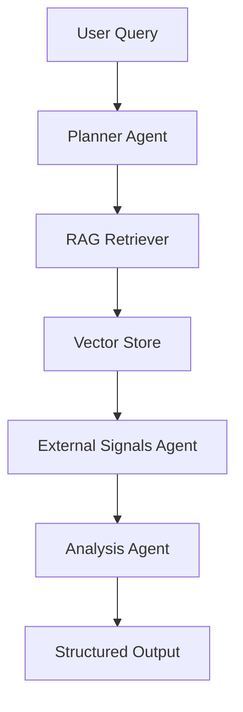

# 🌍 Geopolitical Risk & Markets Agent

An **agentic AI system** for geopolitical risk analysis, combining  
**retrieval-augmented generation (RAG)**, **context-aware external macroeconomic signals**,  
and a lightweight **interactive UI**.

---

## 📌 Overview

This project implements an end-to-end **agentic pipeline** that:

- Decomposes complex geopolitical queries into structured research plans
- Grounds analysis in a curated document corpus (RAG)
- Enriches insights with **context-aware external macroeconomic signals**
- Produces structured, evidence-backed market impact assessments

The system is designed to resemble **internal research tools** used by risk, policy, and strategy teams.
The system is orchestrated using a **LangGraph-based agent state machine**.

---

## 🧠 Architecture


---

## 🤖 Agents

### Planner Agent
- Breaks the user query into focused research sub-questions
- Defines analytical scope and relevance

### RAG Research Agent
- Retrieves relevant document chunks from a vector database
- Uses a curated corpus (e.g., IMF, World Bank, BIS reports)

### Analysis Agent
- Produces structured outputs:
  - `MARKET_IMPACTS`
  - `RISKS`
  - `CONFIDENCE`
- Enforces strict citation and formatting guardrails

### External Signals Agent
- Extracts relevant countries from the query context
- Fetches macroeconomic indicators (e.g., Trade % of GDP)
  via the **World Bank Public API**
- Adds contextual signals without influencing core reasoning

---

## 🔑 Configuration

This project uses **OpenAI-compatible LLMs** for planning and analysis.

To run the system locally, you must provide an API key via an environment variable.

### Required Environment Variables

```bash
OPENAI_API_KEY=your_api_key_here
```
---

## Knowledge Base (Optional)

The agent supports Retrieval-Augmented Generation (RAG).

To enable domain-specific intelligence, you can connect a custom knowledge base by ingesting documents such as:

- Policy papers  
- Intelligence reports  
- Financial analyses  
- Geopolitical research  
- Internal PDFs  

If no knowledge base is provided, the system falls back to model reasoning + external signals.

---

## ✅ Evaluation Framework

This project includes a built-in evaluation layer designed to measure agent reasoning quality — not just fluency.

Rather than relying on subjective inspection, responses are scored automatically against a benchmark suite that includes both standard and adversarial queries.

### What the evaluator measures

Each response is scored on a **0–10 scale** using production-oriented heuristics:

- **Risk analysis depth** — presence of multiple, distinct downside risks  
- **External signal awareness** — ability to incorporate macro indicators into reasoning  
- **Market / asset-level impacts** — decision-grade relevance for investors  
- **Scenario construction** — structured base vs. escalation thinking  
- **Confidence calibration** — avoids unjustified certainty or default neutrality  
- **Decision utility** — clear, actionable investor takeaway  

Perfect scores are intentionally rare — the evaluator caps inflated ratings when analytical depth is limited.

---

### Adversarial Benchmarking

The benchmark intentionally includes ambiguity and false-premise queries to stress-test:

- reasoning robustness  
- hallucination resistance  
- confidence discipline  

This helps ensure the agent behaves more like an institutional risk analyst than a generic LLM.

---

### Run evaluation
```bash
python evaluate/run_eval.py
```
---

## 🖥️ Interfaces

### Streamlit UI

Run an interactive end-to-end analysis:
```bash
streamlit run ui/app.py 
```
### CLI
```bash
python scripts/run_planner.py
```
---

## ⚙️ Tech Stack

- Python
- LangGraph (agent orchestration)
- LangChain
- Vector Database (Chroma)
- OpenAI-compatible LLMs
- World Bank Public API
- Streamlit

---

## 🔒 Data & Ethics

- Public data sources only
- No proprietary or sensitive data
- Analysis is **non-prescriptive** and **not investment advice**

---

## ⚠️ Disclaimer

This project is for educational and research purposes only  
and does not constitute financial or investment advice.


